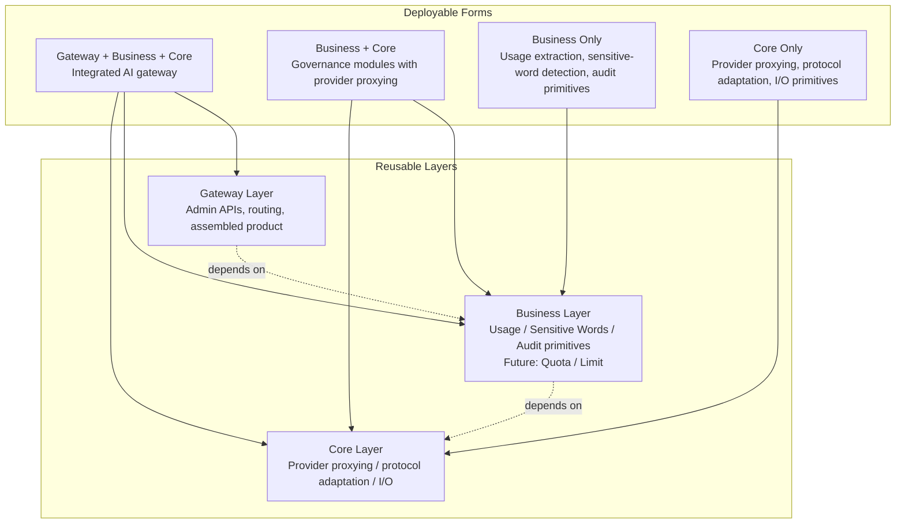

<div align="center">


<h1 align="center" style="margin: 0;">Fabric</h1>

<p align="center" style="margin: 0;">
  A modular AI gateway framework for proxying, key management, model routing, and usage governance.
</p>

Fabric is a modular AI gateway framework. You can run as full AI gateway service or selectively import the Core and Business layers as libraries and compose them into your own services.

Fabric is not intended to be only a proxy service. Its goal is to provide reusable AI gateway primitives: transparent proxying, API key management, downstream-to-upstream key mapping, channel/model mapping, usage tracking, sensitive-word detection, provider audit logs, and future governance modules such as quota and limit controls.

</div>

<p align="center">
    </img>
    </img>
    </img>
</p>

<p align="center">
    English | <a href="./README.zh-CN.md">简体中文</a>
</p>

## 💡 Why This Project Exists

Many AI gateway or AI application projects, such as new_api, axonhub, and similar systems, repeatedly need to maintain the same infrastructure:

- Their own API key system.
- Their own mapping between downstream keys and upstream provider keys.
- Their own channel, model, and provider mappings.
- Their own usage logging, aggregation, and query logic.
- Their own sensitive-word, quota, limit, audit, and policy modules.
- Their own glue between proxy, business logic, and a complete gateway product.

Fabric exists to split these common capabilities into independent, composable, reusable layers. You can run the top-level integrated gateway directly, or you can extract only the Core or Business capabilities you need and embed them into your own service instead of rebuilding the same gateway foundation again.

## 🧭 Project Positioning

| Feature                                  | Description                                                                                                                                          |
| ---------------------------------------- | ---------------------------------------------------------------------------------------------------------------------------------------------------- |
| 🧩 Layered modular gateway               | A pluggable, layered modular gateway.                                                                                                                |
| 🌐 Multi-provider and multimodal         | A multi-provider, multimodal AI gateway foundation.                                                                                                  |
| 🖥️ Modern Web Console                    | A modern gateway product with an easy-to-operate Web Console and optional OIDC browser login.                                                        |
| 📊 Dynamic data dashboard                | A dynamic data dashboard.                                                                                                                            |
| ⚡ High concurrency and availability     | A high-concurrency, high-availability gateway architecture.                                                                                          |
| 🔁 Transparent proxying                  | Callers use Fabric Gateway API Keys while Fabric resolves channels, models, upstream base URLs, and provider credentials before forwarding requests. |
| 📈 Usage logging                         | Records key, channel, model, prompt-token, completion-token, and provider-specific token usage where supported                                       |
| 🛡️ Fire Wall                             | Detects sensitive text on supported input and output surfaces, supports model-scoped dictionaries and runtime updates                                |
| 🎞️ Multi-provider and multimodal support | OpenAI-compatible, Alibaba Bailian, Seedance, Google, Extrotec, Anthropic, and more                                                                  |

## 🏗️ Architecture

Fabric is designed as reusable layers, not as a single fixed deployment shape. You can run the complete gateway, combine Business with Core, or reuse only the Business or Core layer inside your own system.



Supported deployment and reuse forms include:

- **Gateway + Business + Core**: run Fabric as a complete AI gateway with admin APIs, proxy routes, usage logging, model/channel/key management, provider audit logs, Web Console, and policy modules.
- **Business + Core**: use governance capabilities together with provider proxying without adopting the full integrated gateway product.
- **Business only**: embed usage extraction, sensitive-word detection, audit primitives, or policy helpers into an existing gateway.
- **Core only**: embed provider proxying, protocol adaptation, and low-level I/O primitives into your own service.

### Core Layer

Core is the protocol and transparent proxying layer. It handles provider request forwarding, response handling, protocol adaptation, and low-level proxy capabilities.

It is useful for:

- Projects that only need transparent OpenAI/provider proxying.
- Projects that want to embed proxying into their own service.
- Gateways that want to reuse provider adapters.

### Business Layer

Business contains cross-cutting governance primitives such as usage extraction, sensitive-word detection, and audit helpers. Quota and limit modules are future governance directions.

It is useful for:

- Existing proxy services that only need provider-specific usage extraction.
- Existing business gateways that only need sensitive-word detection primitives.
- Systems that need different policies by model, key, or channel.

### Integrated Gateway Layer

Integrated Gateway combines Core and Business capabilities into a complete gateway product.

It is useful for:

- Users who want to deploy a complete AI gateway directly.
- Users who do not want to manually compose Core and Business modules.
- Scenarios where writing a configuration file and running the gateway is enough.

## 🌐 Provider / Model Vendors

Provider/model vendors include:

- OpenAI
- Google
- Anthropic
- xAI
- DeepSeek
- Meta
- Mistral
- Perplexity
- TII UAE
- Amazon
- Liquid AI
- Upstage
- MiniMax (Hailuo)
- Kimi (Moonshot AI)
- IBM
- Reka
- Tencent
- Baidu
- Z AI (Zhipu)
- ByteDance Seed
- Xiaomi
- Cohere
- Alibaba
- Kunlun Tech
- Kling AI
- iFLYTEK Spark
- Microsoft
- ...

Fabric is designed to continue expanding toward 300+ providers.

## 🚀 Quick Start

### 1. Clone and Start with Docker Compose

```bash
git clone https://github.com/HyperToken-dev/Fabric.git
cd Fabric
docker compose up -d
```

Docker Compose builds the gateway image from `Dockerfile`, starts PostgreSQL, and exposes:

- Proxy Server: `http://localhost:3002`
- Admin Server and Web Console: `http://localhost:9090`

The tracked `configs/config.docker.yaml` is used by Docker Compose. It is mounted into the container as `/app/configs/config.yaml`, so Docker users do not need to create a separate `configs/config.yaml` before starting Fabric.

The gateway runs database migrations from `db/migrations/` during startup. After startup, open the Web Console on the Admin Server, sign in if OAuth is enabled, create a channel for your desired provider, add a model, and configure a real upstream provider key before proxying production traffic.

Docker Compose uses the tracked `configs/config.docker.yaml`. That file currently includes an OAuth/OIDC example configuration. For a real deployment, point the `oauth` block at your own OIDC issuer and use your own client secret and session secret. For local-only development, you can disable OAuth in the config and Fabric will use a built-in system administrator identity.

### 2. OAuth User Permissions

When OAuth is enabled, Fabric reads user identity and permissions from the OIDC provider. The Web Console and management APIs treat users with the `fabric_admin` permission as administrators. Users without this permission can sign in, but they are not granted administrator privileges.

For the default Casdoor setup:

1. Open the Casdoor console(with port `8000`) and sign in with the default account `admin` and password `123`.
2. Create a permission named `fabric_admin`.
3. Add the organization members who should be Fabric administrators to that permission.

Fabric expects the OIDC user claims to include a stable `id` value and a `permissions` claim. The `permissions` claim can be either a string list such as `["fabric_admin"]` or an object list such as `[{"name":"fabric_admin"}]`.

### 3. Optional Fire Wall

Fire Wall is managed from the Web Console. Use the `Fire Wall` page to enable detection, create dictionaries, set model scopes, and manage words. Docker Compose persists this runtime data in the `fabric-sensitive` named volume.

### 4. Local Development Run

For local development without Docker, prepare PostgreSQL, edit `configs/config.yaml`, then run:

```bash
make generate
make run
```

## 📖 Detailed Usage

See [how_to_use.md](./how_to_use.md) for exact configuration fields, management APIs, provider API format values, model type values, proxy route examples, Fire Wall behavior, usage logging behavior, and Core / Business library integration guidance.

## 🛠️ Development Commands

```bash
go build ./...              # build all packages
go vet ./...                # vet all packages
go test ./...               # run tests
go run ./cmd/gateway        # start gateway; reads configs/config.yaml

docker compose up -d        # start Fabric and PostgreSQL with Docker Compose
docker compose down         # stop Docker services

make generate               # sqlc generate, then buf generate
make build                  # generate, then go build ./...
make run                    # go run ./cmd/gateway
make lint                   # go vet ./...
make test                   # go test ./...
make sqlc-check             # sqlc compile
```

### Frontend Development

```bash
cd web/fabric
pnpm install
pnpm dev                    # start the Vite development server
pnpm build                  # type-check and build the frontend
pnpm lint                   # run oxlint
pnpm format                 # format handwritten frontend source
```

## 🗺️ Roadmap

- Add more provider adapters.
- Support more model types and protocol forms.
- Add quota management.
- Add limit and rate-limiting capabilities.
- Add audit and policy workflows.
- Add a more complete management console.
- Continue strengthening independent deployment and library usage for Core, Business, and Integrated Gateway layers.
