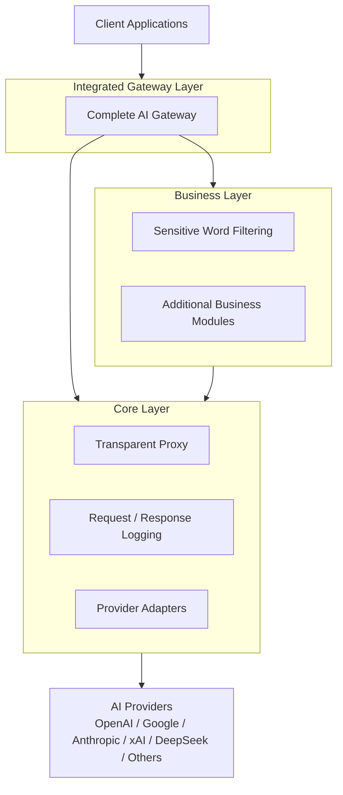
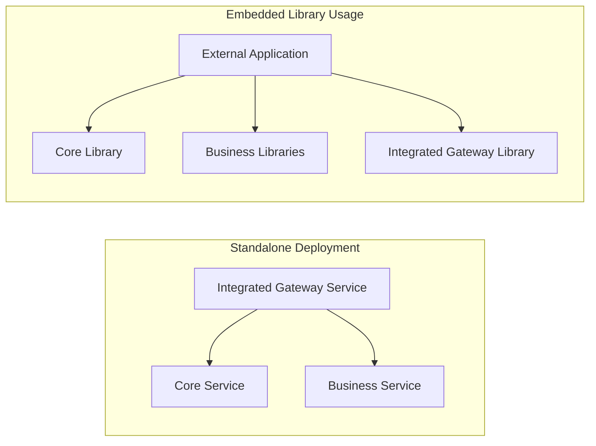

# HyperToken

HyperToken is a modular AI gateway framework designed to support transparent AI API proxying, observability, policy enforcement, and higher-level gateway composition.

The project is planned around three independent but composable layers:

1. **Core Layer**
2. **Business Layer**
3. **Integrated Gateway Layer**

Each layer can be deployed as a standalone service or imported as a library by external applications.

## Vision

HyperToken aims to provide a flexible foundation for building AI infrastructure across different usage scenarios:

- Transparent proxying for mainstream AI providers
- Request and response logging
- Token usage tracking and metering
- Business policy enforcement
- Extensible gateway composition
- Standalone deployment or embedded library usage

The architecture is intentionally layered so that protocol-level capabilities, business-level capabilities, and full gateway composition can evolve independently.

## Architecture Overview

## Layer 1: Core

The Core layer is the protocol layer of HyperToken.

It provides the fundamental AI gateway capabilities, including transparent request forwarding and logging. This layer is responsible for adapting requests and responses between client applications and upstream AI providers.

The Core layer is expected to support major AI providers, including:

- OpenAI
- Google
- Anthropic
- xAI
- DeepSeek
- Meta
- Mistral
- Perplexity
- TII UAE
- Amazon
- Liquid AI
- Upstage
- MiniMax（海螺）
- Kimi（月之暗面）
- IBM
- Reka
- Tencent（腾讯）
- Baidu（百度）
- Z AI（智谱）
- ByteDance Seed（字节跳动 Seed）
- Xiaomi（小米）
- Cohere
- Alibaba（阿里）
- Kunlun Tech（昆仑万维）
- Kling AI（可灵）
- iFLYTEK Spark（讯飞星火）
- Microsoft

Core can be used in two ways:

- **Standalone deployment**: run Core as an independent proxy service.
- **Embedded library**: import Core into external applications and build custom gateway behavior on top of it.

Primary responsibilities of the Core layer include:

- Transparent AI API proxying
- Provider request forwarding
- Provider response handling
- Request and response logging
- Provider adapter abstraction
- Foundation for token usage tracking and observability

## Layer 2: Business

The Business layer contains independent business modules built on top of the protocol capabilities provided by Core.

The first planned business module is sensitive word filtering. This module can inspect and enforce policies on AI requests or responses before they are forwarded or returned.

Like Core, each business module can be used independently:

- **Standalone deployment**: run a business capability as its own service.
- **Embedded library**: import a business module into an external application.
- **Composable module**: combine multiple business modules with Core or the Integrated Gateway layer.

Planned and future business capabilities may include:

- Sensitive word filtering
- Policy enforcement
- Safety rules
- Rate limiting
- Quota management
- Audit workflows
- Custom enterprise governance modules

Each business capability should remain independently deployable and independently importable.

## Layer 3: Integrated Gateway

The Integrated Gateway layer combines the Core layer and Business layer into a complete AI gateway product.

It is designed for users who want a full gateway experience without manually composing protocol capabilities and business modules themselves.

The Integrated Gateway can also be used in two ways:

- **Standalone deployment**: run it as a complete AI gateway service.
- **Embedded library**: import it into external systems that need a pre-integrated gateway stack.

The Integrated Gateway is responsible for packaging multiple capabilities into a unified entry point, including:

- Provider proxying
- Logging
- Business filtering
- Policy execution
- Gateway-level configuration
- Unified deployment
- Unified integration API

## Deployment And Integration Model

## Design Principles

HyperToken follows several architectural principles:

- **Layered design**: protocol, business, and integrated gateway capabilities are separated.
- **Composable modules**: each layer can be combined with others when needed.
- **Independent deployment**: every layer or business module can be deployed on its own.
- **Library-first compatibility**: capabilities should be importable by external code.
- **Provider extensibility**: support for AI providers should be adapter-based and expandable.
- **Business extensibility**: business modules should be isolated, replaceable, and independently maintained.

## Project Direction

The current project will evolve toward this layered architecture.

Future refactoring will focus on separating the codebase into clear protocol, business, and integrated gateway boundaries while preserving the ability to run HyperToken as a complete AI gateway.
