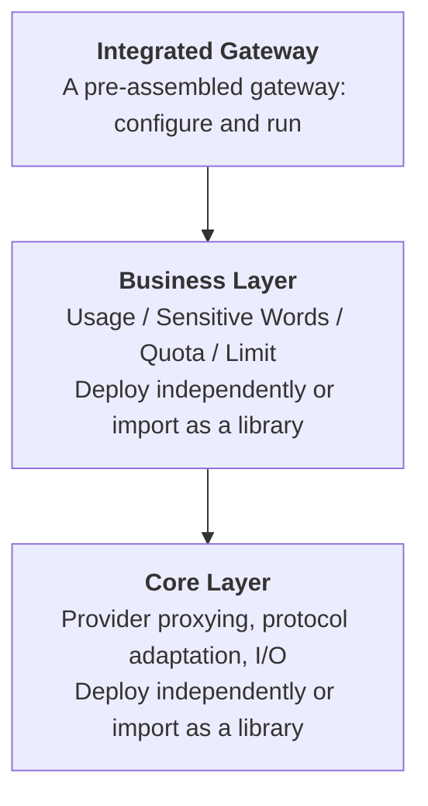

# Fabric

Fabric is a modular AI gateway framework. It can run as a pre-assembled OpenAI-compatible gateway, or you can selectively import the Core and Business layers as libraries and compose them into your own services.

Fabric is not intended to be only a proxy service. Its goal is to provide reusable AI gateway primitives: transparent proxying, API key management, downstream-to-upstream key mapping, channel/model mapping, usage tracking, sensitive-word detection, and future governance modules such as quota and limit controls.

## Why This Project Exists

Many AI gateway or AI application projects, such as new_api, axonhub, and similar systems, repeatedly need to maintain the same infrastructure:

- Their own API key system.
- Their own mapping between downstream keys and upstream provider keys.
- Their own channel, model, and provider mappings.
- Their own usage logging, aggregation, and query logic.
- Their own sensitive-word, quota, limit, audit, and policy modules.
- Their own glue between proxy, business logic, and a complete gateway product.

Fabric exists to split these common capabilities into independent, composable, reusable layers. You can run the top-level integrated gateway directly, or you can extract only the Core or Business capabilities you need and embed them into your own service instead of rebuilding the same gateway foundation again.

## Project Positioning

Fabric currently implements an OpenAI-compatible gateway with:

- Transparent OpenAI API proxying.
- Gateway API key authentication.
- Channel management.
- Model management.
- Usage logging and querying.
- Model-scoped sensitive-word detection.
- PostgreSQL-backed persistence.
- Startup database migrations.
- connect-go management APIs.

Future work will expand Fabric with more providers, more model types, and additional governance modules such as quota, limit, audit, and policy orchestration.

## Feature Highlights

Current distinctive features:

- **Usage logging**: records the key, channel, model, prompt tokens, and completion tokens for requests, then exposes the data for later querying and aggregation.
- **Model-scoped sensitive-word detection**: dictionaries can be scoped to specific models, allowing different models to use different detection policies.

Planned capabilities:

- **Quota**: token or request quotas by key, channel, model, tenant, or other business dimensions.
- **Limit**: rate limiting, concurrency limiting, and model-call frequency controls.
- **Policy governance**: audit, risk control, safety rules, and enterprise workflow modules.

## Architecture

Fabric is designed around three layers:



### Core Layer

Core is the protocol and transparent proxying layer. It handles provider request forwarding, response handling, protocol adaptation, and low-level proxy capabilities.

It is useful for:

- Projects that only need transparent OpenAI/provider proxying.
- Projects that want to embed proxying into their own service.
- Gateways that want to reuse provider adapters.

### Business Layer

Business contains cross-cutting governance capabilities such as usage tracking, sensitive-word detection, quota, limit, and audit modules.

It is useful for:

- Existing proxy services that only need usage logging.
- Existing business gateways that only need sensitive-word detection.
- Systems that need different policies by model, key, or channel.

### Integrated Gateway Layer

Integrated Gateway combines Core and Business capabilities into a complete gateway product.

It is useful for:

- Users who want to deploy a complete AI gateway directly.
- Users who do not want to manually compose Core and Business modules.
- Scenarios where writing a configuration file and running the gateway is enough.

## Design Advantages

- **Independent layers**: Core, Business, and Integrated Gateway have clear boundaries and can evolve independently.
- **Independent deployment**: each layer can be deployed as its own service and composed by team or business boundaries.
- **Library embedding**: existing systems can import the needed packages and embed Fabric capabilities directly into their own code.
- **Less duplicated gateway work**: API keys, provider keys, channels, models, usage, and policy governance become reusable infrastructure.
- **Control plane and data plane separation**: Admin APIs manage keys, channels, models, and usage; Proxy APIs handle model traffic.
- **Gateway key and provider key isolation**: callers use Fabric-issued gateway API keys, while upstream provider keys stay in channels and are injected by the gateway.
- **Multi-provider evolution**: providers can be added through adapters so the business layer does not bind directly to one vendor's protocol.

## Supported and Planned Providers / Models

Fabric currently focuses on OpenAI-compatible APIs. The Core Layer will continue to add provider adapters so models from different vendors can be connected through the same gateway primitives.

Planned provider/model vendors include:

- OpenAI
- Google
- Anthropic
- xAI
- DeepSeek
- Meta
- Mistral
- Perplexity
- TII UAE
- Amazon
- Liquid AI
- Upstage
- MiniMax (Hailuo)
- Kimi (Moonshot AI)
- IBM
- Reka
- Tencent
- Baidu
- Z AI (Zhipu)
- ByteDance Seed
- Xiaomi
- Cohere
- Alibaba
- Kunlun Tech
- Kling AI
- iFLYTEK Spark
- Microsoft
- ...

**More than 300+ providers would be supported.**

## Quick Start

### 1. Prepare PostgreSQL

Fabric stores channels, API keys, models, and usage logs in PostgreSQL.

```bash
createdb hypertoken
```

### 2. Update Configuration

Edit `configs/config.yaml` and make sure the database connection is correct:

```yaml
proxyAddr: 3002
adminAddr: 9090
logLevel: info

sensitiveWordDetect: false

db:
  addr: 127.0.0.1
  user: postgres
  port: 5432
  dbName: hypertoken
  password: "your-password"
  maxIdle: 20
  maxOpen: 100
  maxLifeTime: 1h
```

If you have not prepared sensitive-word dictionaries, set `sensitiveWordDetect: false` first.

To enable sensitive-word detection, configure rule-based dictionaries and prepare the corresponding files under `configs/stwd/`:

```yaml
sensitiveWordDetect: true
sensitiveWordDictionaries:
  - name: example_name
    effectModels: [gpt-5.5]
    keywordFileList: [st-01, st-02]
```

Each entry is a detection rule. `name` is required and is only used as a human-readable rule name in logs and match results. `effectModels` controls which models the rule applies to; leave it empty to apply the rule to all models. `keywordFileList` is required and lists keyword files under `configs/stwd/`, so `st-01` loads `configs/stwd/st-01.txt`. Each keyword file contains one keyword per line.

### 3. Start the Gateway

```bash
go run ./cmd/gateway
```

Or:

```bash
make run
```

By default, Fabric starts two servers:

- Proxy Server: `:3002`
- Admin Server: `:9090`

The gateway runs database migrations from `db/migrations/` during startup.

## Detailed Usage

See [how_to_use.md](./how_to_use.md) for detailed configuration, management APIs, proxy examples, and library integration guidance.

## Development Commands

```bash
go build ./...              # build all packages
go vet ./...                # vet all packages
go test ./...               # run tests
go run ./cmd/gateway        # start gateway; reads configs/config.yaml

make generate               # sqlc generate, then buf generate
make build                  # generate, then go build ./...
make run                    # go run ./cmd/gateway
make lint                   # go vet ./...
make test                   # go test ./...
make sqlc-check             # sqlc compile
```

## Roadmap

- Add more provider adapters.
- Support more model types and protocol forms.
- Add quota management.
- Add limit and rate-limiting capabilities.
- Add audit and policy workflows.
- Add a more complete management console.
- Continue strengthening independent deployment and library usage for Core, Business, and Integrated Gateway layers.
