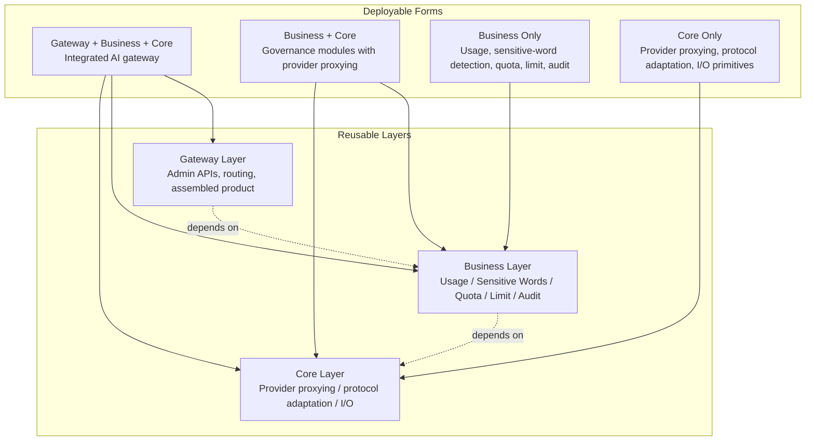

<div align="center">


<h1 align="center" style="margin: 0;">Fabric</h1>

<p align="center" style="margin: 0;">
  一个模块化 AI 网关框架，用于代理转发、密钥管理、模型路由和用量治理。
</p>

Fabric 是一个模块化 AI 网关框架。你既可以将它作为完整的 AI 网关服务运行，也可以按需导入 Core 层和 Business 层作为库，并组合进你自己的服务中。

Fabric 并不只是一个代理服务。它的目标是提供可复用的 AI 网关基础能力：透明代理、API Key 管理、下游密钥到上游密钥的映射、渠道和模型映射、用量追踪、敏感词检测，以及未来的配额、限流等治理模块。

</div>

<p align="center">
    </img>
    </img>
    </img>
</p>

<p align="center">
    <a href="./README.md">English</a> | 简体中文
</p>

## 💡 为什么有这个项目？

许多 AI 网关或 AI 应用项目，例如 new_api、axonhub 以及类似系统，都会反复维护同一类基础设施：

- 自己的 API Key 系统。
- 下游密钥与上游服务商密钥之间的映射。
- 自己的渠道、模型和服务商映射。
- 自己的用量日志、聚合和查询逻辑。
- 自己的敏感词、配额、限流、审计和策略模块。
- 代理层、业务逻辑和完整网关产品之间的粘合代码。

Fabric 的目标是将这些通用能力拆分为独立、可组合、可复用的层。你可以直接运行顶层集成网关，也可以只抽取所需的 Core 或 Business 能力，将它们嵌入自己的服务中，而不必一遍又一遍地重建相同的网关基础设施。

## 🧭 项目定位

| Feature | Description |
| ------- | ----------- |
| 🧩 可插拔式的分层模块网关 | 可插拔式的分层模块网关。 |
| 🌐 多厂商与多模态 | 多厂商、多模态 AI 网关基础设施。 |
| 🖥️ 现代化 Web Console | 提供现代化、易操作的 Web Console。 |
| 📊 动态数据看板 | 动态数据看板。 |
| ⚡ 高并发与高可用 | 面向高并发、高可用的网关架构。 |
| 🔁 透明代理转发 | 调用方使用 Fabric Gateway API Key，Fabric 在转发请求前自动解析渠道、模型、上游 base URL 和服务商凭据。 |
| 📈 用量记录 | 记录已支持服务商的 key、channel、model、prompt token 和 completion token 用量。 |
| 🛡️ Fire Wall | 在转发支持的输入前检测敏感文本，支持按模型作用域配置词库并热更新。 |
| 🎞️ 多厂商与多模态支持 | 支持 OpenAI、Google、Anthropic、Seedance 等。 |

## 🏗️ 架构

Fabric 被设计为可复用的分层能力，而不是单一固定的部署形态。你可以运行完整网关，将 Business 与 Core 组合使用，也可以只在自己的系统中复用 Business 或 Core 层。



支持的部署和复用形态包括：

- **Gateway + Business + Core**：将 Fabric 作为完整的 OpenAI-compatible 网关运行，包含管理 API、代理路由、用量日志、模型/渠道/密钥管理和策略模块。
- **Business + Core**：在不采用完整集成网关产品的情况下，同时使用治理能力和服务商代理能力。
- **Business only**：将用量日志、敏感词检测、配额、限流、审计或策略模块嵌入已有网关。
- **Core only**：将服务商代理、协议适配和底层 I/O 原语嵌入自己的服务。

### Core Layer

Core 是协议和透明代理层。它负责服务商请求转发、响应处理、协议适配和底层代理能力。

适用于：

- 只需要透明 OpenAI 或服务商代理的项目。
- 希望将代理能力嵌入自身服务的项目。
- 希望复用服务商适配器的网关。

### Business Layer

Business 包含用量追踪、敏感词检测、配额、限流、审计等横切治理能力。

适用于：

- 只需要用量日志的已有代理服务。
- 只需要敏感词检测的已有业务网关。
- 需要按模型、密钥或渠道配置不同策略的系统。

### Integrated Gateway Layer

Integrated Gateway 将 Core 和 Business 能力组合为完整的网关产品。

适用于：

- 希望直接部署完整 AI 网关的用户。
- 不希望手动组合 Core 和 Business 模块的用户。
- 只需编写配置文件并运行网关即可满足需求的场景。

## 🌐 支持的服务商

计划支持的服务商和模型厂商包括：

- OpenAI
- Google
- Anthropic
- xAI
- DeepSeek
- Meta
- Mistral
- Perplexity
- TII UAE
- Amazon
- Liquid AI
- Upstage
- MiniMax (Hailuo)
- Kimi (Moonshot AI)
- IBM
- Reka
- Tencent
- Baidu
- Z AI (Zhipu)
- ByteDance Seed
- Xiaomi
- Cohere
- Alibaba
- Kunlun Tech
- Kling AI
- iFLYTEK Spark
- Microsoft
- ...

**未来将支持超过 300 个服务商。**

## 🚀 快速开始

### 1. Docker Compose

```bash
git clone https://github.com/HyperToken-dev/Fabric.git
cd Fabric
docker compose up -d
```

Docker Compose 会基于 `Dockerfile` 构建网关镜像，启动 PostgreSQL，并暴露：

- Proxy Server：`http://localhost:3002`
- Admin Server 和 Web Console：`http://localhost:9090`

Docker Compose 使用仓库中的 `configs/config.docker.yaml`。该文件会被挂载到容器内的 `/app/configs/config.yaml`，因此 Docker 用户在启动 Fabric 前不需要额外创建 `configs/config.yaml`。

网关会在启动时运行 `db/migrations/` 中的数据库迁移。启动完成后，请为目标服务商创建渠道，例如 OpenAI、Alibaba Bailian 或 Seedance；添加模型；并通过 Admin API 或 Web Console 配置真实的上游 provider key，再开始代理生产流量。

### 2. 可选：Fire Wall

Fire Wall 由 Web Console 管理。使用 `Fire Wall` 页面开启检测、创建词库、设置模型范围并维护词条。Docker Compose 会将运行时数据持久化到 `fabric-sensitive` 命名卷。

### 3. 本地开发运行

不使用 Docker 进行本地开发时，请先准备 PostgreSQL，编辑 `configs/config.yaml`，然后运行：

```bash
make generate
make run
```

## 📖 详细用法

详细配置、管理 API、代理示例和库集成指南见 [how_to_use.md](./how_to_use.md)。

## 🛠️ 开发命令

```bash
go build ./...              # 构建所有包
go vet ./...                # 对所有包执行 vet 检查
go test ./...               # 运行测试
go run ./cmd/gateway        # 启动网关；读取 configs/config.yaml

docker compose up -d        # 使用 Docker Compose 启动 Fabric 和 PostgreSQL
docker compose down         # 停止 Docker 服务

make generate               # 先 sqlc generate，再 buf generate
make build                  # generate 后执行 go build ./...
make run                    # go run ./cmd/gateway
make lint                   # go vet ./...
make test                   # go test ./...
make sqlc-check             # sqlc compile
```

### 前端

```bash
cd web/fabric
pnpm install
pnpm dev                    # 启动 Vite 开发服务器
pnpm build                  # 类型检查并构建前端
pnpm lint                   # 运行 oxlint
pnpm format                 # 格式化手写前端源码
```

## 🗺️ 路线图

- 增加更多服务商适配器。
- 支持更多模型类型和协议形态。
- 增加配额管理。
- 增加限制和速率限制能力。
- 增加审计和策略工作流。
- 增加更完整的管理控制台。
- 持续强化 Core、Business 和 Integrated Gateway 层的独立部署与库式使用能力。
