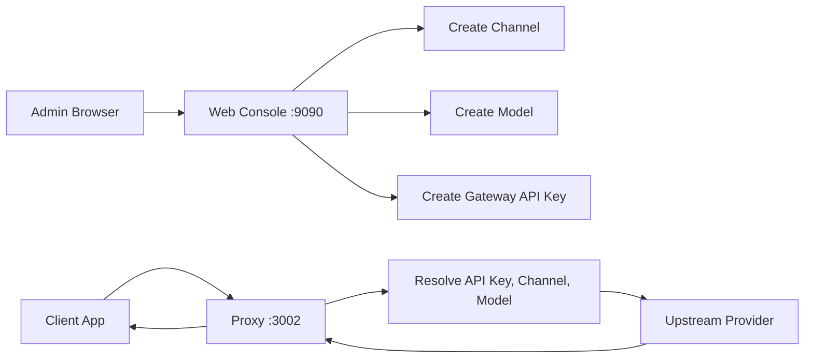
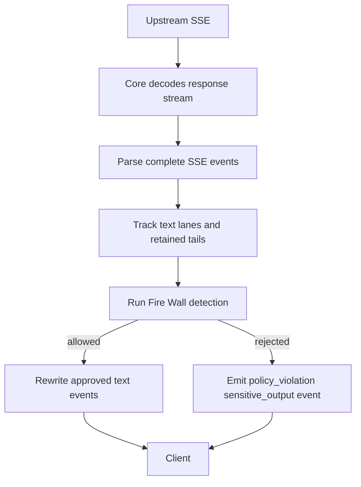
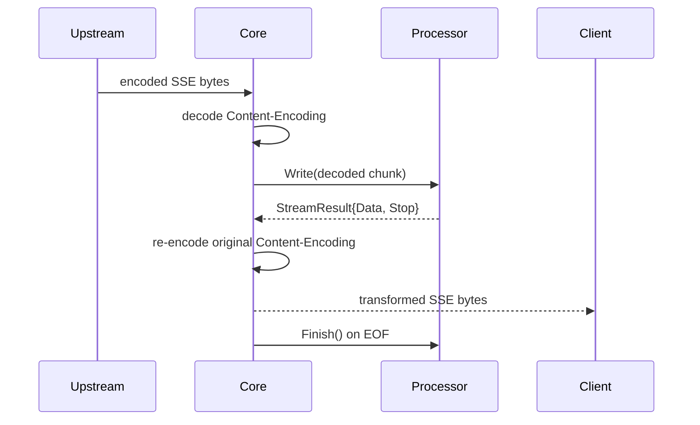

# Fabric Usage Guide

This guide covers the integrated Fabric gateway, management APIs, provider-routed proxy calls, Fire Wall behavior, usage logging, and selective reuse of the Core and Business packages.

For a short project overview, start with [README.md](./README.md). This file is the detailed operational and integration reference.

## 1. Quick Start

### 1.1 Requirements

- Docker and Docker Compose for the recommended startup path.
- Go 1.26.4 and PostgreSQL when running locally without Docker.
- A real upstream provider key for the channel you configure.
- An OIDC provider when `oauth.enabled` is true.

### 1.2 Start with Docker Compose

```bash
git clone https://github.com/HyperToken-dev/Fabric.git
cd Fabric
docker compose up -d
```

Docker Compose builds the gateway image, starts PostgreSQL, waits for database health checks, and starts Fabric.

Default endpoints:

| Server | Default URL | Purpose |
| --- | --- | --- |
| Proxy | `http://localhost:3002` | Provider-routed AI API proxy |
| Admin | `http://localhost:9090` | Web Console and connect-go management APIs |

Docker Compose uses the tracked `configs/config.docker.yaml` and mounts it inside the Fabric container as `/app/configs/config.yaml`. You do not need to create a separate `configs/config.yaml` for Docker.

The gateway runs migrations from `db/migrations/` at startup. Migrations create and maintain tables such as `channels`, `api_keys`, `models`, `usage_logs`, `integral_logs`, and `provider_tasks`. They do not seed provider channels or models.

### 1.3 First Gateway Flow



1. Start Fabric.
2. Open the Web Console on `http://localhost:9090`.
3. Sign in through OIDC if OAuth is enabled.
4. Create a channel for the upstream provider.
5. Create or select a model under that channel.
6. Create a Gateway API Key.
7. Send client traffic to the Proxy Server with `Authorization: Bearer <gateway-key>`.

## 2. Configuration

### 2.1 Configuration Files

Fabric reads a file named `config.yaml`. Which source file you edit depends on startup mode:

| Startup mode | File to edit | Runtime path |
| --- | --- | --- |
| Docker Compose | `configs/config.docker.yaml` | Mounted as `/app/configs/config.yaml` |
| Local Go run | `configs/config.yaml` | Read from the local `configs/` directory |

### 2.2 Core Fields

```yaml
proxyAddr: 3002
adminAddr: 9090
logLevel: info
timeZone: Asia/Shanghai

db:
  addr: postgres
  user: root
  port: 5432
  dbName: fabric
  password: "123456"
  maxIdle: 20
  maxOpen: 100
  maxLifeTime: 1h

log:
  maxSize: 100
  maxBackups: 10
  maxAge: 30
  compress: true
```

| Field | Meaning |
| --- | --- |
| `proxyAddr` | Proxy server listen port. Clients call provider APIs through this port. |
| `adminAddr` | Admin server listen port for the Web Console and connect-go APIs. |
| `logLevel` | Zap log level, for example `info`. |
| `timeZone` | Time zone used by usage service date handling. |
| `db.*` | PostgreSQL connection and pool settings. |
| `log.*` | Log rotation settings. |

### 2.3 OAuth / OIDC

Docker configuration currently includes an OAuth example:

```yaml
oauth:
  enabled: true
  issuerURL: "http://casdoor.localhost:8000/.well-known/openid-configuration"
  clientID: "your-client-id"
  clientSecret: "your-client-secret"
  redirectURL: "http://localhost:9090/auth/callback"
  scopes:
    - openid
    - email
    - profile
  sessionSecret: "replace-with-at-least-32-characters"
```

When `oauth.enabled` is true:

- `issuerURL`, `clientID`, `clientSecret`, `redirectURL`, and `sessionSecret` are required.
- `sessionSecret` must be at least 32 characters.
- `redirectURL` must point at the admin server callback path `/auth/callback`.
- `/auth/login` starts the browser login flow.
- `/auth/callback` completes the OIDC flow and writes the session cookie.
- Admin APIs and Web Console pages require the authenticated session.

When `oauth.enabled` is false, the admin server uses a built-in system principal:

- OpenID: `system`
- Email: `system@fabric.local`
- Role: `admin`
- Permission: `fabric_admin`

Use OAuth for shared or production environments. OAuth-disabled mode is primarily useful for isolated local development.

### 2.4 Local Run

For local development without Docker:

1. Start PostgreSQL.
2. Create the configured database, for example:

```bash
createdb dbexample
```

3. Edit `configs/config.yaml`.
4. Run:

```bash
make generate
make run
```

## 3. Provider and Model Reference

### 3.1 API Formats

Channels select provider behavior with `api_format`.

| Value | Constant | Provider behavior |
| ---: | --- | --- |
| `1` | `models.APIFormatOpenAI` | OpenAI-compatible APIs |
| `2` | `models.APIFormatAlibabaBailian` | Alibaba Bailian video task APIs |
| `3` | `models.APIFormatSeedance` | Seedance async video task APIs |
| `4` | `models.APIFormatGoogle` | Google `/v1beta/interactions` |
| `5` | `models.APIFormatExtrotec` | Extrotec image/video generation and task APIs |

### 3.2 Model Types

| Value | Constant | Meaning |
| ---: | --- | --- |
| `1` | `models.ModelTypeText` | Text model |
| `2` | `models.ModelTypeVideo` | Video model |
| `3` | `models.ModelTypeImage` | Image model |

### 3.3 Provider Matrix

| Provider | API format | Main routes | Model validation | Structured usage |
| --- | ---: | --- | --- | --- |
| OpenAI-compatible | `1` | `/v1/chat/completions`, `/v1/responses`, and compatible pass-through routes | Generation requests validate configured model | Yes, with fallback for supported Chat/Responses paths |
| Alibaba Bailian | `2` | `/api/v1/services/aigc/video-generation/video-synthesis`, `/api/v1/tasks/<task_id>` | Task creation validates configured model | No structured video usage logging currently |
| Seedance | `3` | `/api/v3/contents/generations/tasks`, task query/delete under that prefix | Task creation validates configured model | Yes, only for Fabric-tracked successful tasks with positive `usage.completion_tokens` |
| Google | `4` | `/v1beta/interactions` | Interaction requests validate configured model | Yes, from non-streaming response usage or `interaction.completed` SSE usage |
| Extrotec | `5` | `/v1/video/generations`, `/v1/video/i2v`, `/v1/video/ref2v`, `/v1/images/generations`, `/v1/videos/<task_id>`, `/v1/videos/<task_id>/content` | Generation requests validate configured model | No structured usage logging currently |

## 4. Management APIs

Management APIs are connect-go services on the Admin Server. Browser requests are session-protected when OAuth is enabled.

Common paths:

| Service | Path prefix |
| --- | --- |
| Auth | `/proto.AuthService/*` |
| Channel admin | `/proto.ChannelAdminService/*` |
| Channel client | `/proto.ChannelClientService/*` |
| Model admin | `/proto.ModelAdminService/*` |
| Model client | `/proto.ModelClientService/*` |
| API key admin | `/proto.ApiKeyAdminService/*` |
| API key client | `/proto.ApiKeyClientService/*` |
| Usage | `/proto.UsageService/*` |
| Integral logs | `/proto.IntegralLogService/*` |
| Sensitive words | `/proto.SensitiveWordService/*` |

### 4.1 Create Channels

OpenAI-compatible:

```bash
curl http://localhost:9090/proto.ChannelAdminService/CreateChannel \
  -H "Content-Type: application/json" \
  -d '{
    "channelName": "openai-prod",
    "baseUrl": "https://api.openai.com",
    "apiFormat": 1,
    "providerKey": "sk-your-provider-key"
  }'
```

Alibaba Bailian:

```bash
curl http://localhost:9090/proto.ChannelAdminService/CreateChannel \
  -H "Content-Type: application/json" \
  -d '{
    "channelName": "bailian-video",
    "baseUrl": "https://dashscope.aliyuncs.com",
    "apiFormat": 2,
    "providerKey": "sk-your-dashscope-key"
  }'
```

Seedance:

```bash
curl http://localhost:9090/proto.ChannelAdminService/CreateChannel \
  -H "Content-Type: application/json" \
  -d '{
    "channelName": "seedance-video",
    "baseUrl": "https://your-seedance-upstream.example.com",
    "apiFormat": 3,
    "providerKey": "sk-your-seedance-key"
  }'
```

Google:

```bash
curl http://localhost:9090/proto.ChannelAdminService/CreateChannel \
  -H "Content-Type: application/json" \
  -d '{
    "channelName": "google-interactions",
    "baseUrl": "https://generativelanguage.googleapis.com",
    "apiFormat": 4,
    "providerKey": "your-google-api-key"
  }'
```

Extrotec:

```bash
curl http://localhost:9090/proto.ChannelAdminService/CreateChannel \
  -H "Content-Type: application/json" \
  -d '{
    "channelName": "extrotec-media",
    "baseUrl": "https://your-extrotec-upstream.example.com",
    "apiFormat": 5,
    "providerKey": "sk-your-extrotec-key"
  }'
```

Channel responses do not expose `providerKey`.

### 4.2 Create Models

Text model:

```bash
curl http://localhost:9090/proto.ModelAdminService/CreateModel \
  -H "Content-Type: application/json" \
  -d '{
    "modelName": "gpt-5.5",
    "channelId": 1,
    "status": 1,
    "modelType": 1
  }'
```

Video model:

```bash
curl http://localhost:9090/proto.ModelAdminService/CreateModel \
  -H "Content-Type: application/json" \
  -d '{
    "modelName": "doubao-seedance-2-0-260128",
    "channelId": 3,
    "status": 1,
    "modelType": 2
  }'
```

Image model:

```bash
curl http://localhost:9090/proto.ModelAdminService/CreateModel \
  -H "Content-Type: application/json" \
  -d '{
    "modelName": "Z-imageturbo-t2i",
    "channelId": 5,
    "status": 1,
    "modelType": 3
  }'
```

Use `ListCatalogModels` to inspect the built-in catalog for restricted API formats:

```bash
curl http://localhost:9090/proto.ModelAdminService/ListCatalogModels \
  -H "Content-Type: application/json" \
  -d '{"apiFormat": 5}'
```

### 4.3 Create Gateway API Keys

A Gateway API Key is the downstream key clients send to Fabric. It is not the upstream provider key stored on the channel.

```bash
curl http://localhost:9090/proto.ApiKeyAdminService/CreateApiKey \
  -H "Content-Type: application/json" \
  -d '{
    "keyName": "local-dev",
    "channelId": 1
  }'
```

The raw key is returned only on creation. Store it securely and use it on Proxy Server requests:

```text
Authorization: Bearer hy_xxx
```

### 4.4 Usage and Sensitive APIs

Usage summary:

```bash
curl http://localhost:9090/proto.UsageService/GetUsageSummary \
  -H "Content-Type: application/json" \
  -d '{}'
```

Fire Wall status:

```bash
curl http://localhost:9090/proto.SensitiveWordService/GetSensitiveWordStatus \
  -H "Content-Type: application/json" \
  -d '{}'
```

The Web Console is the preferred interface for sensitive-word dictionaries because it manages runtime storage and reload behavior.

## 5. Proxy Examples

Clients call the Proxy Server with a Fabric-issued Gateway API Key. Fabric resolves the channel and model, injects the upstream provider credential, and forwards to the selected provider implementation.

### 5.1 OpenAI Chat Completions

```bash
curl http://localhost:3002/v1/chat/completions \
  -H "Authorization: Bearer hy_xxx" \
  -H "Content-Type: application/json" \
  -d '{
    "model": "gpt-5.5",
    "messages": [
      {"role": "user", "content": "Hello"}
    ]
  }'
```

Streaming:

```bash
curl http://localhost:3002/v1/chat/completions \
  -H "Authorization: Bearer hy_xxx" \
  -H "Content-Type: application/json" \
  -d '{
    "model": "gpt-5.5",
    "stream": true,
    "messages": [
      {"role": "user", "content": "Hello"}
    ]
  }'
```

For streaming Chat Completions, Fabric injects:

```json
{
  "stream_options": {
    "include_usage": true
  }
}
```

### 5.2 OpenAI Responses

Non-streaming:

```bash
curl http://localhost:3002/v1/responses \
  -H "Authorization: Bearer hy_xxx" \
  -H "Content-Type: application/json" \
  -d '{
    "model": "gpt-5.5",
    "input": "Write a short status update."
  }'
```

Streaming:

```bash
curl http://localhost:3002/v1/responses \
  -H "Authorization: Bearer hy_xxx" \
  -H "Content-Type: application/json" \
  -d '{
    "model": "gpt-5.5",
    "stream": true,
    "input": "Write a short status update."
  }'
```

### 5.3 Alibaba Bailian Text-to-Video

Task creation:

```bash
curl http://localhost:3002/api/v1/services/aigc/video-generation/video-synthesis \
  -H "Authorization: Bearer hy_xxx" \
  -H "Content-Type: application/json" \
  -d '{
    "model": "wan2.7-t2v-2026-06-12",
    "input": {
      "prompt": "A cat running under moonlight"
    },
    "parameters": {
      "resolution": "720P",
      "ratio": "16:9",
      "duration": 5
    }
  }'
```

Task fetch:

```bash
curl http://localhost:3002/api/v1/tasks/<task_id> \
  -H "Authorization: Bearer hy_xxx"
```

Fabric injects `X-DashScope-Async: enable` on Bailian video synthesis requests. Alibaba Bailian video task responses are proxied and audited, but structured video usage logging is not currently recorded.

### 5.4 Seedance Tasks

Task creation:

```bash
curl http://localhost:3002/api/v3/contents/generations/tasks \
  -H "Authorization: Bearer hy_xxx" \
  -H "Content-Type: application/json" \
  -d '{
    "model": "doubao-seedance-2-0-260128",
    "content": [
      {
        "type": "text",
        "text": "A cat running under moonlight"
      }
    ]
  }'
```

Task query:

```bash
curl http://localhost:3002/api/v3/contents/generations/tasks/<task_id> \
  -H "Authorization: Bearer hy_xxx"
```

Task delete:

```bash
curl -X DELETE http://localhost:3002/api/v3/contents/generations/tasks/<task_id> \
  -H "Authorization: Bearer hy_xxx"
```

Fabric tracks only tasks created through Fabric. Usage is recorded at most once when a tracked task reaches a successful status and the response includes positive `usage.completion_tokens`.

### 5.5 Google Interactions

```bash
curl http://localhost:3002/v1beta/interactions \
  -H "Authorization: Bearer hy_xxx" \
  -H "Content-Type: application/json" \
  -d '{
    "model": "gemini-3-flash-preview",
    "input": "Summarize the current deployment status."
  }'
```

Fabric forwards Google requests with `x-goog-api-key` using the provider key stored on the channel and removes downstream `Authorization` from the upstream request.

### 5.6 Extrotec

Text-to-video:

```bash
curl http://localhost:3002/v1/video/generations \
  -H "Authorization: Bearer hy_xxx" \
  -H "Content-Type: application/json" \
  -d '{
    "model": "MiniMax-H3",
    "prompt": "A cinematic city skyline at sunrise"
  }'
```

Image-to-video:

```bash
curl http://localhost:3002/v1/video/i2v \
  -H "Authorization: Bearer hy_xxx" \
  -H "Content-Type: application/json" \
  -d '{
    "model": "MiniMax-H3",
    "prompt": "Animate this scene gently",
    "image_url": "https://example.com/input.png"
  }'
```

Reference-to-video:

```bash
curl http://localhost:3002/v1/video/ref2v \
  -H "Authorization: Bearer hy_xxx" \
  -H "Content-Type: application/json" \
  -d '{
    "model": "MiniMax-H3",
    "prompt": "Use these references for style"
  }'
```

Image generation:

```bash
curl http://localhost:3002/v1/images/generations \
  -H "Authorization: Bearer hy_xxx" \
  -H "Content-Type: application/json" \
  -d '{
    "model": "Z-imageturbo-t2i",
    "prompt": "A clean product render on a white background"
  }'
```

Task status:

```bash
curl http://localhost:3002/v1/videos/<task_id> \
  -H "Authorization: Bearer hy_xxx"
```

Task content:

```bash
curl http://localhost:3002/v1/videos/<task_id>/content \
  -H "Authorization: Bearer hy_xxx"
```

Extrotec generation requests validate `model` and inspect `prompt`, `forward_prompt`, and `negative_prompt` for input sensitive words. Status and content fetches are proxied without model validation.

## 6. Usage Logging

Usage rows are associated with Gateway API Key, channel, model, prompt tokens, completion tokens, and creation time. Provider request/response audit data is recorded separately in `integral_logs`.

| Provider | Usage behavior |
| --- | --- |
| OpenAI-compatible | Reads upstream `usage` from non-streaming and SSE responses. If usage is missing on supported Chat Completions or Responses paths, Fabric can estimate fallback prompt/completion tokens from request and output text. |
| Alibaba Bailian | No structured video usage logging currently. Integral logs still record provider request/response audit data. |
| Seedance | Records completion tokens only for Fabric-tracked successful tasks with positive `usage.completion_tokens`; ignores `usage.total_tokens` alone. |
| Google | Extracts interaction usage from non-streaming response `usage` or streaming `interaction.completed` events. |
| Extrotec | No structured usage logging currently. Integral logs still record provider request/response audit data. |

OpenAI Responses nuance:

- Sensitive output extraction checks non-streaming `output_text` and `output[*].content[*].text`.
- Usage fallback prefers `output_text` when present and falls back to `output[*].content` only when `output_text` is empty.
- Nested visible text is recursively inspected where supported by the extractor.

## 7. Fire Wall

Fire Wall is managed from the Web Console for the integrated gateway. Use the `Fire Wall` page to enable detection, create dictionaries, set model scopes, and manage words.

Runtime storage:

| Startup mode | Runtime store |
| --- | --- |
| Docker Compose | `fabric-sensitive` named volume |
| Local Go run | `configs/sensitive/` |

Detection behavior:

| Provider | Input checks | Output checks |
| --- | --- | --- |
| OpenAI-compatible | Chat Completions messages, Responses instructions/input, and generic model extraction where supported | Non-streaming Chat/Responses text; SSE Chat/Responses text events |
| Alibaba Bailian | Not currently documented as Fire Wall checked by integrated gateway | No structured output check documented |
| Seedance | `content[]` entries where `type == "text"` | No output check documented |
| Google | Interaction `input` string or text content entries | No output check documented |
| Extrotec | `prompt`, `forward_prompt`, `negative_prompt` | No output check documented |

OpenAI-compatible SSE output safety:



Chat Completions streaming uses `choices[*].index` as the text lane. Responses streaming uses `item_id`, `output_index`, and `content_index` for text delta lanes. Snapshot events are checked as full text before matching retained tails are released.

If input text matches, Fabric returns `403` with `prompt rejected`. If non-streaming output matches, Fabric returns `422` with `model output rejected, please change your prompt`. If OpenAI-compatible SSE output matches, Fabric emits an SSE error event with code `sensitive_output` and stops the upstream stream.

If a runtime Fire Wall update fails because the new files are invalid, Fabric keeps the previous valid rules active and returns or logs the reload error.

## 8. Core Layer Reuse

Use Core when your service already owns authentication, model selection, persistence, billing, and policy decisions, but you want Fabric's provider-aware proxy primitives.

Core does not own:

- Gateway API key management.
- Channel or model persistence.
- Model validation.
- Usage log persistence.
- Integral log persistence.
- Business rejection policy.

### 8.1 Generic Proxy

```go
package main

import (
    "net/http"

    coreproxy "github.com/HyperToken-dev/fabric/core/proxy"
)

var proxy = coreproxy.New(coreproxy.Options{
    OnComplete: func(resp *http.Response, decodedBody []byte) {
        // Persist usage, audit, or diagnostics in your own system.
    },
})

func handler(w http.ResponseWriter, r *http.Request) {
    proxy.ServeHTTP(w, r, coreproxy.Upstream{
        BaseURL: "https://api.openai.com",
        APIKey:  "sk-upstream-provider-key",
    })
}
```

### 8.2 Provider Wrappers

Provider wrappers configure protocol-specific defaults:

| Wrapper | Default behavior |
| --- | --- |
| `core/providers/openai.New` | Injects `stream_options.include_usage=true` for streaming `/v1/chat/completions` requests. |
| `core/providers/Alibaba.New` | Injects `X-DashScope-Async: enable` for Bailian video synthesis requests. |
| `core/providers/google.New` | Uses `x-goog-api-key` and removes upstream `Authorization`. |
| `core/providers/seedance.New` | Uses generic proxy behavior. |
| `core/providers/extrotec.New` | Uses generic proxy behavior. |

### 8.3 Stream Transform

`StreamTransformFunc` can create a per-response `StreamProcessor` for SSE responses.



`StreamResult.Data` is decoded output that Core re-encodes before sending to the client. `StreamResult.Stop` closes upstream early after final output is sent. The processor instance is owned by one response stream and is called serially.

`OnComplete` receives decoded upstream stream bytes before transformation, so usage parsers can inspect provider-native events even when client-visible output is rewritten.

## 9. Business Layer Reuse

Use Business packages when you want Fabric's usage or sensitive-word primitives inside another service. Business packages do not send HTTP responses, persist usage rows, create audit records, or decide billing. Your service owns those side effects.

### 9.1 Usage Primitives

OpenAI-compatible:

```go
import openaiusage "github.com/HyperToken-dev/fabric/business/usage/openai"

parsedUsage, err := openaiusage.ExtractNonStreamingWithFallback(req, rawBody, contentEncoding, model)
if err != nil {
    return err
}
recordUsage(parsedUsage.PromptTokens, parsedUsage.CompletionTokens)
```

Streaming OpenAI-compatible responses:

```go
import (
    "github.com/HyperToken-dev/fabric/business/usage"
    openaiusage "github.com/HyperToken-dev/fabric/business/usage/openai"
)

trackedBody := openaiusage.NewTrackingReaderWithFallbackAndErrors(
    req,
    upstreamBody,
    contentEncoding,
    model,
    func(parsedUsage *usage.Usage) {
        recordUsage(parsedUsage.PromptTokens, parsedUsage.CompletionTokens)
    },
    func(decodedBody []byte) {
        recordAudit(decodedBody)
    },
    func(err error) {
        recordUsageParseError(err)
    },
)
defer trackedBody.Close()
```

Google interactions:

```go
import googleusage "github.com/HyperToken-dev/fabric/business/usage/google"

parsedUsage, err := googleusage.ExtractInteraction(rawBody)
if err != nil {
    return err
}
recordUsage(parsedUsage.PromptTokens, parsedUsage.CompletionTokens)
```

Google interaction SSE:

```go
parsedUsage, err := googleusage.ExtractInteractionStreaming(decodedBody)
if err != nil {
    return err
}
```

Seedance task usage:

```go
import seedanceusage "github.com/HyperToken-dev/fabric/business/usage/seedance"

parsedUsage, err := seedanceusage.ExtractTaskUsage(taskResponseBody)
if err != nil {
    return err
}
if parsedUsage != nil {
    recordUsage(0, parsedUsage.CompletionTokens)
}
```

### 9.2 Sensitive-Word Primitives

In-memory detector:

```go
import "github.com/HyperToken-dev/fabric/business/sensitive"

detector, err := sensitive.NewDetector(
    sensitive.Dictionary{
        Name:         "default-block-list",
        Words:        []string{"blocked phrase", "secret"},
        EffectModels: []string{"gpt-5.5"},
    },
)
if err != nil {
    return err
}

result := detector.Detect("gpt-5.5", "prompt containing secret")
if result.Rejected() {
    rejectRequest(result.Matches)
}
```

File-backed detector:

```go
detector, err := sensitive.LoadDetectorFromFiles("configs/sensitive", []sensitive.DictionaryFileConfig{
    {
        Name:            "default-block-list",
        EffectModels:    []string{"gpt-5.5"},
        KeywordFileList: []string{"default"},
    },
})
if err != nil {
    return err
}
```

Reloadable policy:

```go
policy := sensitive.NewReloadablePolicy(sensitive.Snapshot{})

_, err := policy.Reload(ctx, func(ctx context.Context) (sensitive.SourceState, error) {
    detector, err := sensitive.NewDetector(sensitive.Dictionary{
        Name:  "default-block-list",
        Words: []string{"blocked phrase", "secret"},
    })
    if err != nil {
        return sensitive.SourceState{}, err
    }
    return sensitive.SourceState{Enabled: true, Detector: detector, DictionaryCount: 1}, nil
})
if err != nil {
    return err
}
```

Watch reload paths:

```go
err := sensitive.Watch(ctx, sensitive.WatchOptions{
    Paths: []string{"configs/sensitive"},
    Reload: func(ctx context.Context) error {
        _, err := policy.Reload(ctx, loadSourceState)
        return err
    },
})
```

Provider text extraction:

| Package | Use |
| --- | --- |
| `business/sensitive/openai` | Extract OpenAI-compatible prompt text, non-streaming output text, and streaming text events. |
| `business/sensitive/google` | Extract Google interaction input text. |
| `business/sensitive/extrotec` | Extract Extrotec `prompt`, `forward_prompt`, and `negative_prompt`. |

Example:

```go
import sensitiveopenai "github.com/HyperToken-dev/fabric/business/sensitive/openai"

promptReq, err := sensitiveopenai.ExtractPromptRequest(req)
if err != nil {
    return err
}
for _, prompt := range promptReq.Prompts {
    if detector.Detect(promptReq.Model, prompt).Rejected() {
        rejectRequest(nil)
    }
}
```

`ExtractPromptRequest` reads and restores `req.Body`, so the request can still be forwarded after inspection.

## 10. Troubleshooting

| Symptom | Check |
| --- | --- |
| `401 unauthorized` from Proxy Server | Client must send `Authorization: Bearer <gateway-key>`, not the upstream provider key. |
| `403 channel disabled` | The API key's channel status must be active. |
| `unsupported api format` | The channel `api_format` must map to a registered provider implementation. |
| `unsupported model` | The requested model must exist under the channel and be enabled. Restricted catalogs must use known model names. |
| Extrotec returns `unsupported extrotec path` | Use only the documented Extrotec routes in section 5.6. |
| Google request returns `unsupported google path` | Use `POST /v1beta/interactions`. |
| Image model appears unknown | Use `modelType: 3` for image models such as Extrotec image generation catalog entries. |
| Admin redirects to `/auth/login` | OAuth is enabled and the browser session is missing or expired. |
| Admin starts without login | OAuth is disabled, so Fabric uses the built-in system administrator principal. |
| Fire Wall update fails | Fix the invalid dictionary/runtime data; Fabric keeps the previous valid rules active. |
| OpenAI stream emits `sensitive_output` | The streamed model output matched Fire Wall output rules and Fabric closed the stream with a policy error. |
